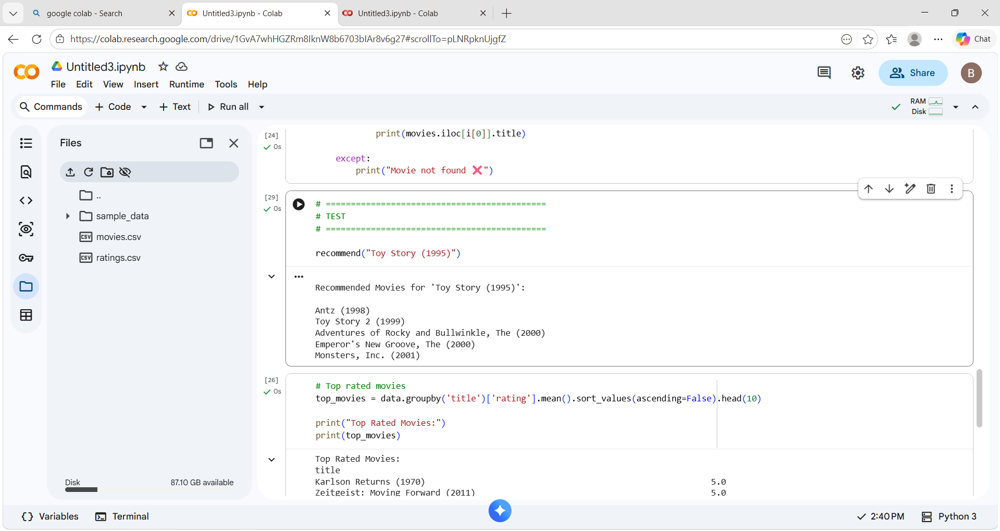

# 🎬 Movie Recommendation System (AI Project)

[](https://colab.research.google.com/drive/1GvA7whHGZRm8IknW8b6703bIAr8v6g27?usp=sharing)

## 🚀 Project Overview
This project is an Artificial Intelligence-based Movie Recommendation System that suggests movies to users based on similarity scores using machine learning techniques.

It replicates how platforms like Netflix and Amazon Prime recommend content to users.

---

## 🎯 Objective
To build an intelligent system that:
- Analyzes movie features
- Calculates similarity between movies
- Recommends top relevant movies to users

---

## 🧠 Approach Used
✔ Content-Based Filtering  
✔ Feature Extraction using CountVectorizer  
✔ Cosine Similarity for recommendation  

---

## 🛠️ Tech Stack
- Python
- Pandas
- NumPy
- Scikit-learn

---

## 📂 Dataset
- movies.csv → Movie details  
- ratings.csv → User ratings  

---

## ⚙️ Workflow
1. Data Collection  
2. Data Preprocessing  
3. Feature Engineering  
4. Model Building using Cosine Similarity  
5. Recommendation Function  

---

## ▶️ How to Run
1. Open the notebook in Google Colab  
2. Upload dataset files  
3. Run all cells  
4. Call:
```python
recommend("Toy Story (1995)")

## 📷 Output
()

## 🔗 Project Link
(Add GitHub link here after uploading)

## 📌 Future Scope
- Web app using Streamlit
- Personalized recommendations
